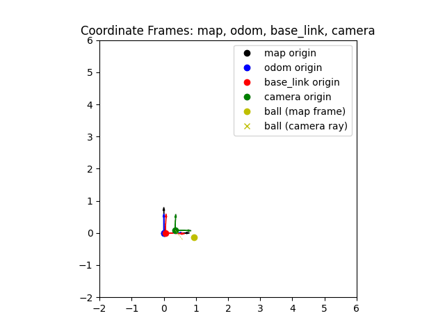

# Coordinate Frames 2D — Robotics TF Simulation

This mini-project is part of my daily **robotics and autonomous systems learning practice**.  
It implements a simple 2D simulation of **robot coordinate frames** and **transform chaining** using pure Python:

- `map → odom → base_link → camera` frame chain  
- A robot moving in the `map` frame  
- A camera mounted on the robot (`base_link → camera`)  
- A ball detected in the **camera frame**, converted to the **map frame**  
- Real-time 2D visualization using `matplotlib`  

This is a minimal, ROS-free version of what tools like **ROS2 TF** and **RViz** do with transforms.

---

## 🎬 Coordinate Frames 2D Simulation (Animation Preview)

---

## 📂 Project Structure
coordinate-frames-2d/
│

├── frames_math.py   # Core 2D rotation + transform + composition utilities

├── sim_frames.py    # Main simulation + visualization (map, odom, base_link, camera, ball)

└── README.md

---

## 🚀 How to Run
Requirements:
- Python 3.x
- matplotlib

Install:
- pip install matplotlib

Run:
- python sim_frames.py

You will see:
- `map` origin (black)
- `odom` origin (blue)
- `base_link` origin (red)
- `camera` origin (green)
- `ball` shown in the global map frame (yellow)
- Colored axes showing each frame’s orientation over time

---

## 🔧 Core Math Concepts (used in this project)
**Rotation Matrix**
\[
R(\theta) = \begin{bmatrix} \cos\theta & -\sin\theta \\ \sin\theta & \cos\theta \end{bmatrix}
\]

**Apply Transform**
\[
p' = R p + t
\]

**Compose Transforms**
\[
(R_1, t_1) \circ (R_2, t_2) = (R_1 R_2, \; R_1 t_2 + t_1)
\]

These are the same operations used in SLAM, TF2, odometry, and kinematics — here implemented in clear 2D.

---

## 🧠 What the Code Actually Does (in simple words)
### 1️⃣ Robot pose updated in the `map` frame
The robot moves a little forward and rotates slightly each frame:
- robot_theta += omega
- robot_x += v * cos(robot_theta)
- robot_y += v * sin(robot_theta)

→ simulates wandering motion.

### 2️⃣ Building the transform chain
- `map → odom` (identity in this project)
- `odom → base_link` (robot’s pose)
- `base_link → camera` (camera mounted on robot)
- Composed to get:
- `map → base_link` → `map → camera` (robot’s pose + camera’s pose)
- `map → camera` (robot’s pose + camera’s pose)

### 3️⃣ Convert ball from CAMERA frame → MAP frame
Ball is defined relative to the camera:
- p_ball_camera = (0.6, -0.2)
Robot needs it in map frame:
- p_map = R_map_camera * p_ball_camera + t_map_camera
This is exactly what real navigation stacks need for planning.

### 4️⃣ Visualization
- Each frame origin drawn as a point
- Each frame axes drawn using columns of the rotation matrix
- A yellow dashed line from camera to ball shows the **camera ray**

You literally **see transforms**, not just compute them.

### 🔍 What this code does step-by-step

- `p_ball_camera` is the direction to the ball **as seen by the camera**.
- We transform that direction into the **map frame** using `R_map_camera` only (no translation).
- This gives us a point in the map frame that lies along the camera’s viewing direction.
- We draw a **yellow dashed line** from the camera origin toward that transformed direction.
- Visually, that dashed ray tells us:  
  **“The camera is looking in this direction — and the ball lies somewhere along this ray.”**

The ball marker (yellow circle) is the **true ball position in the map**.  
The dashed line is the **visual cone / ray** — like what real robots draw.

---

### 🧩 What I Learned from Building This

From this simulation I now clearly understand:

✔ How to model a robot pose as **(x, y, θ)** in the world (`map` frame).  

✔ How to build a full frame chain using transforms:
- `map → odom → base_link → camera`

✔ How to compose transforms to compute new frames:
- `map → camera = (map → base_link) ∘ (base_link → camera)`

✔ How to transform a sensor point into world coordinates:
- `p_map = R_map_camera * p_camera + t_map_camera`

✔ How a camera “ray” is just a **direction vector rotated** into the global frame.  

✔ How to use **matplotlib + FuncAnimation** to visualize moving frames and transforms in 2D.

---

### 🔥 Why This Matters in Real Robotics

This knowledge directly applies to:

- ROS2 TF trees
- RViz frame visualization
- SLAM and localization
- Odometry correction
- Camera / LiDAR object detection to world mapping
- Navigation and motion planning

In real robots:

- Sensors speak in their own frame
- Control & planning require the map frame
- TF converts between them using exactly the math built in this project

This simulation is a visible and simplified version of TF2, helping me understand transforms at a mathematical and conceptual level before working with ROS2.

---
